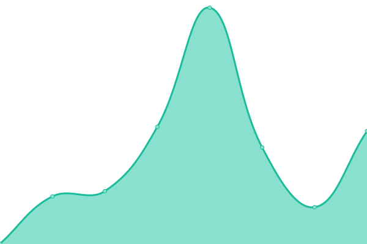

# [📈 Live Status](https://cayepezg.github.io/status): <!--live status--> **🟩 All systems operational**

This repository contains the open-source uptime monitor and status page for [cayepezg](https://cayepezg.github.io/status), powered by [Upptime](https://github.com/upptime/upptime).

With [Upptime](https://upptime.js.org), you can get your own unlimited and free uptime monitor and status page, powered entirely by a GitHub repository. We use [Issues](https://github.com/cayepezg/status/issues) as incident reports, [Actions](https://github.com/cayepezg/status/actions) as uptime monitors, and [Pages](https://cayepezg.github.io/status) for the status page.

<!--start: status pages-->
<!-- This summary is generated by Upptime (https://github.com/upptime/upptime) -->
<!-- Do not edit this manually, your changes will be overwritten -->
<!-- prettier-ignore -->
| URL | Status | History | Response Time | Uptime |
| --- | ------ | ------- | ------------- | ------ |
|  [Mis Revistas](https://www.misrevistas.com) | 🟩 Up | [mis-revistas.yml](https://github.com/cayepezg/status/commits/HEAD/history/mis-revistas.yml) | 

 472ms
     
 | 

<a href="https://cayepezg.github.io/status/history/mis-revistas">100.00%</a>
    

|  [El Universal](https://www.eluniversal.com) | 🟩 Up | [el-universal.yml](https://github.com/cayepezg/status/commits/HEAD/history/el-universal.yml) | 

 500ms
     
 | 

<a href="https://cayepezg.github.io/status/history/el-universal">100.00%</a>
    

|  [Estampas](https://www.estampas.com) | 🟩 Up | [estampas.yml](https://github.com/cayepezg/status/commits/HEAD/history/estampas.yml) | 

 376ms
     
 | 

<a href="https://cayepezg.github.io/status/history/estampas">100.00%</a>
    

|  [Notitarde](https://www.notitarde.com.ve) | 🟩 Up | [notitarde.yml](https://github.com/cayepezg/status/commits/HEAD/history/notitarde.yml) | 

 2466ms
     
 | 

<a href="https://cayepezg.github.io/status/history/notitarde">100.00%</a>
    

<!--end: status pages-->

[**Visit our status website →**](https://cayepezg.github.io/status)

## 📄 License

- Powered by: [Upptime](https://github.com/upptime/upptime)
- Code: [MIT](./LICENSE) © [cayepezg](https://cayepezg.github.io/status)
- Data in the `./history` directory: [Open Database License](https://opendatacommons.org/licenses/odbl/1-0/)
